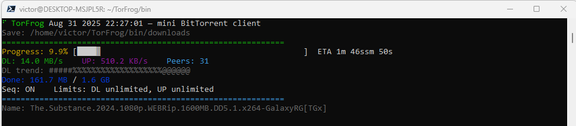

# TorFrog — tiny BitTorrent client


TorFrog is a **minimal, fast, and animated BitTorrent client** written in modern C++ using [libtorrent-rasterbar](https://www.libtorrent.org/).  
It is designed to be **small, easy-to-use, and complete**: a single binary with a smooth TUI, sequential download by default, ETA display, progress bar, sparkline trends, and built-in public trackers.

👉 [**Download TorFrog v1.6.0**](https://github.com/victormeloasm/TorFrog/releases/download/v1.6.0/TorFrog.zip)

---

## Features

- **Animated TUI**: spinner, fractional progress bar (`░▒▓█`), ETA, DL/UP/Peers info.
- **Sequential download ON by default** (great for streaming).
- **DL trend sparkline** (ASCII-only, no missing glyphs).
- **Graceful exit message** when pressing `Ctrl+C` (*“Goodbye, see you soon.”*).
- **Built-in public trackers** (can be disabled with `--no-trackers`).
- **Bandwidth control**: `--max-down <KiBps>`, `--max-up <KiBps>`.
- **Layout options**: `--bar-width <cols>`, `--ascii`, `--no-clear`, `--no-color`.
- **Integrated help/version**: `--help`/`--version` and auto-help when run with no arguments.
- **Auto-versioning** on every build (`__DATE__ __TIME__`).

---

## Screenshot



---

## Build Instructions (Ubuntu 24.04)

Dependencies:
```bash
sudo apt update
sudo apt install -y clang lld pkg-config libtorrent-rasterbar-dev
````

Compile (optimized for size, always using `clang++` + `lld`):

```bash
clang++ -std=c++20 -Os -flto -fdata-sections -ffunction-sections -fuse-ld=lld \
  TorFrog.cpp -o TorFrog $(pkg-config --cflags --libs libtorrent-rasterbar) \
  -Wl,--gc-sections -Wl,--as-needed -s
```

(Optionally compress further with [UPX](https://upx.github.io/)):

```bash
upx --best --lzma TorFrog
```

---

## Usage

Basic syntax:

```bash
TorFrog <magnet_or_torrent_file> [options]
```

Examples:

```bash
# Default (sequential ON, no limits)
./TorFrog "magnet:?xt=urn:btih:YOUR_HASH..." --save downloads

# With bandwidth limits (~10 MiB/s down, 2 MiB/s up)
./TorFrog "magnet:?xt=urn:btih:YOUR_HASH..." --max-down 10m --max-up 2m

# ASCII-only mode with wider bar
./TorFrog "magnet:?xt=urn:btih:YOUR_HASH..." --ascii --bar-width 60

# Show help
./TorFrog --help
```

---

## Options

* `--help`, `-h`, `-?` : Show help and exit
* `--version` : Show version and exit
* `--save <dir>` : Output directory (default: `./downloads`)
* `--no-trackers` : Do not add built-in public trackers
* `--no-color` : Disable ANSI colors
* `--no-clear` : Do not clear the screen (block stream mode)
* `--ascii` : ASCII-only UI (no Unicode spinner/blocks)
* `--seq` / `--no-seq` : Enable/disable sequential download (default: ON)
* `--max-down <KiBps>` : Download rate limit in KiB/s (0 = unlimited)
* `--max-up <KiBps>` : Upload rate limit in KiB/s (0 = unlimited)
* `--bar-width <cols>` : Width of the progress bar (default: 48)

---

## License

TorFrog is released under the MIT License.
Use only for **legal torrents** and content you are allowed to share.

---

🐸 *TorFrog — tiny, fast, sapudo.*


